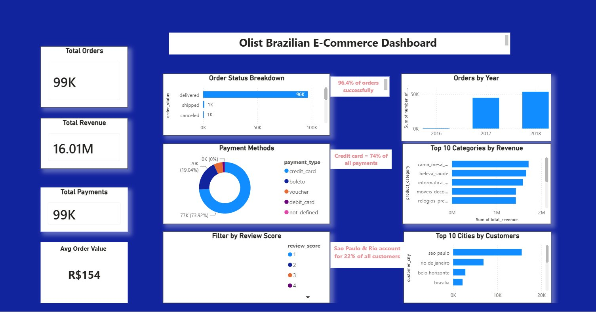

# Olist Brazilian E-Commerce — SQL & Power BI Analysis

> **Business question:** What does 100,000 real e-commerce orders tell us about revenue, customer behaviour, and operational performance — and where are the biggest opportunities to improve?

📊 [View Live Power BI Dashboard](https://app.powerbi.com/view?r=eyJrIjoiYzNiMjc0OGEtMTUxNy00YTEyLTgyM2ItYjQ1YTVlMDliYzY5IiwidCI6ImJkYjc0YjMwLTk1NjgtNDg1Ni1iZGJmLTA2NzU5Nzc4ZmNiYyIsImMiOjh9)

---

## Dashboard Preview

---

## Project Summary

End-to-end SQL analysis and Power BI dashboard built on 99,441 real orders from Olist, Brazil's largest e-commerce marketplace. I wrote 15 SQL queries across 8 joined tables to answer realistic business questions covering revenue, payment behaviour, delivery performance, product mix, and customer satisfaction — then visualised the findings in an interactive Power BI dashboard.

**Tools:** SQLite · Power BI · Excel  
**Dataset:** [Kaggle — Brazilian E-Commerce Public Dataset by Olist](https://www.kaggle.com/datasets/olistbr/brazilian-ecommerce)

---

## Key Findings

| Area | Finding |
|---|---|
| 💰 Revenue | R$16,008,872 total across 99,441 orders |
| 📦 Delivery rate | 96.4% of orders successfully delivered |
| 💳 Payments | Credit card dominates at 74% of transactions |
| 🛒 Avg order value | R$154.10 |
| ⭐ Customer satisfaction | Average review score 4.09 / 5 |
| 🏙️ Geography | São Paulo + Rio de Janeiro = 22% of all customers |
| 🛏️ Top category | Bed, table & bath — 11,115 units sold |
| 💡 Pricing insight | Computer accessories rank 3rd in revenue but 5th in volume — higher margin per unit |
| 🚚 Delivery time | Average 12.6 days (expected given Brazil's geography) |
| ⚠️ Review pattern | 1-star reviews outnumber 2-star — J-curve effect: unhappy customers leave the worst rating |

---

## Business Questions Answered

| # | Question |
|---|---|
| Q1 | How many total orders are in the dataset? |
| Q2 | What are the different order statuses? |
| Q3 | What is the total revenue? |
| Q4 | What are the most popular payment methods? |
| Q5 | What is the average order value? |
| Q6 | What is the highest and lowest order value? |
| Q7 | How many orders were placed each year? |
| Q8 | Which cities have the most customers? |
| Q9 | What are the top 10 best-selling product categories? |
| Q10 | What is the average review score? |
| Q11 | What is the full review score distribution? |
| Q12 | Which sellers made the most sales? |
| Q13 | What is the average delivery time in days? |
| Q14 | Which product categories generate the most revenue? |
| Q15 | Which customers spent the most? |

---

## Data Quality Issues Identified

| Issue | Impact | How I handled it |
|---|---|---|
| 3 orders with undefined payment type and R$0 revenue | Distorts average order value | Flagged in findings; noted as a data quality gap |
| Lowest order value = R$0 (linked to above) | Misleading min value | Highlighted separately rather than treated as valid |
| 2016 and 2018 are incomplete years | Not suitable for YoY comparison | Excluded from year-over-year conclusions |
| Some orders missing delivery date | Skews average delivery time | Filtered using `IS NOT NULL` before calculating average |

---

## Data Model

| Table | Description |
|---|---|
| `orders` | Order IDs, statuses, and timestamps |
| `customers` | Customer IDs and city locations |
| `order_items` | Products within each order |
| `payments` | Payment types and values |
| `reviews` | Customer review scores |
| `products` | Product categories and details |
| `sellers` | Seller IDs and locations |
| `name_translation` | Portuguese to English category translations |

---

## SQL Concepts Used

- `SELECT`, `FROM`, `WHERE`, `GROUP BY`, `ORDER BY`, `LIMIT`
- Aggregate functions: `COUNT`, `SUM`, `AVG`, `MAX`, `MIN`, `ROUND`
- Multi-table `JOIN` (2 and 3 tables)
- Date functions: `JULIANDAY`, `strftime`
- `IS NOT NULL` filtering
- Column aliases with `AS`

---

## Repository Files

| File | Description |
|---|---|
| `olist_ecommerce_analysis.sql` | All 15 SQL queries with comments |
| `Olist_SQL_Analysis_Shweta_Waghmare.docx` | Full written report with results and business interpretation |
| `olist_dashboard_data.xlsx` | Cleaned data used to build the Power BI dashboard |
| `dashboard.png` | Dashboard screenshot |
| `README.md` | This file |

---

## About the Author

**Shweta Waghmare** — Junior Data Analyst based in the UK, open to graduate roles and internships.

- 🔗 [LinkedIn](https://www.linkedin.com/in/shweta-ramesh-waghmare-2a0ba0387/)
- 🐙 [GitHub](https://github.com/srwaghmare01)
- 📊 [AI Job Displacement Dashboard](https://github.com/srwaghmare01/ai-job-displacement-dashboard)
- 🐍 [Python Analytics Portfolio](https://github.com/srwaghmare01/python-data-analytics-portfolio)
